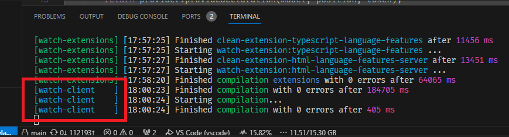

# How to

1. Follow instruction on vscode github to setup this container
- In case u failed to follow
- in github, fork vscode
- install dev container extension
- press F1
- choose `Dev Containers: Clone Repository in Container Volume...`
- choose the repo from your github
- you should be good to go
2. docker container should be created
3. then you docker connect to the container
4. you will see error `grep: /proc/102/environ: Permission denied`
5. because you're in `root` user
6. change to `node` user, `su node`
7. you will see warning `bash: warning: command substitution: ignored null byte in input`
8. just a warning, nothing to be worried of
9. if you want to push changes to the repo
10. you will realize that they use HTTP instead of SSH, making u to input password & unable to push
11. run `git remote -v`
12. you will see that they use `https://...`
13. change to SSH `git remote set-url origin git@github.com:<user>/<repo>.git`
14. that is, `git remote set-url origin git@github.com:lolzz77/vscode.git`

# How to build
Note: I dk if how it works...
I hv a feeling they dont allow end user to build vs code on their own?..
1. `git pull https://github.com/microsoft/vscode.git main`
2. `yarn install`
3. if you get error they complain nodejs version is not compatible
4. install the compatible nodejs version
5. if after installing latest nodejs and when you check `node --version` and it is still old version
6. this means your system is running `node` that locates somewhere else
- i. `echo $PATH`
- this checks what paths system is locating to execute the binary files
- ii. `which node`
- this tells you where the binary executable `node` the system is using
- iii. `whereis node`
- this list out all path that has this `node` binary executable
7. from my system, i found the `node` the system is using, and the location of latest `node` i installed
8. thus, i run the command
- `rm /usr/local/bin/node`
- `sudo ln -s /usr/bin/node /usr/local/bin/node`
9. run `yarn install`
10. then run `yarn watch`
11. then run `bash ./scripts/code.sh`
12. then go to `http://localhost:6080/`
13. you should see `code - oss`
14. if you see error
15. `[Error: ENOENT: no such file or directory, open '/workspaces/vscode/out/vs/code/electron-main/main.js'] {`
16. after few seconds, run `bash ./scripts/code.sh` again, this is due to it is building
17. if you see error
18. `Error launching app Unable to find Electron app at /workspaces/vscode`
19. after few seconds, run `bash ./scripts/code.sh` again, this is due to it is building
20. if you see error
21. `Cannot find module '/workspaces/vscode/out/main'. Please verify that the package.json has a valid "main" entry`
22. keep waiting until you see `watch-client` in the terminal where you run `yarn watch`
23. 
24. this saves quite a while, or try `CTRL + S` in vs code to trigger?... i dk
25. Now i think is `yarn watch` even necessary...? maybe can run `bash ./scripts/code.sh` without `yarn watch`?

# How to dev
1. you must run `yarn watch`, else, changes you made, will not take effect
2. you can run both `bash ./scripts/code.sh` or simply run the debugger
3. in `http://localhost:6080/`, just simply `CTRL + P`
4. input `> reload window`
5. no need to rerun `bash ./scripts/code.sh` or restart debugger
6. if you put log `console.log()`
7. open `Developer: Toggle Developer Tool`
8. your log will appear here
9. 

